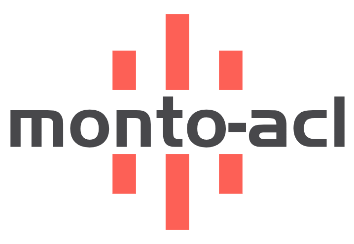

<!-- Improved compatibility of back to top link: See: https://github.com/othneildrew/Best-README-Template/pull/73 -->
<a id="readme-top"></a>
<!--
*** Thanks for checking out the Best-README-Template. If you have a suggestion
*** that would make this better, please fork the repo and create a pull request
*** or simply open an issue with the tag "enhancement".
*** Don't forget to give the project a star!
*** Thanks again! Now go create something AMAZING! :D
-->


<!-- PROJECT SHIELDS -->
<!--
*** I'm using markdown "reference style" links for readability.
*** Reference links are enclosed in brackets [ ] instead of parentheses ( ).
*** See the bottom of this document for the declaration of the reference variables
*** for contributors-url, forks-url, etc. This is an optional, concise syntax you may use.
*** https://www.markdownguide.org/basic-syntax/#reference-style-links
-->

<!-- [![Contributors][contributors-shield]][contributors-url]
[![Forks][forks-shield]][forks-url]
[![Stargazers][stars-shield]][stars-url]
[![Issues][issues-shield]][issues-url]
[![MIT License][license-shield]][license-url]
[![LinkedIn][linkedin-shield]][linkedin-url] -->


<!-- PROJECT LOGO -->
<br />
<div align="center">
  <a href="https://github.com/monto-fe/acl-pro/tree/main">
    
  </a>

  <h3 align="center">ACL-PRO</h3>

  <p align="center">
    一个集成的后台管理系统，实现了权限访问控制，包括mysql、Express的API和React的Web端 (ACL).
    <br />
    <!-- <a href="https://github.com/othneildrew/Best-README-Template"><strong>Explore the docs »</strong></a> -->
    <br />
    <br />
    <a href="https://github.com/monto-fe/acl-pro/tree/main">查看Demo</a>
    ·
    <a href="https://github.com/monto-fe/acl-pro/issues">反馈Bug</a>
    ·
    <a href="https://github.com/monto-fe/acl-pro/pulls">提交Merge</a>
  </p>
</div>

## 快速体验

> 需要本地安装`docker compose`

- 新建目录`acl`
```
mkdir acl && cd acl
```
- 复制`mysql`目录到`acl`目录下
```
cp -r ../acl-pro/mysql ./mysql
```
- 复制下面的`docker-compose.yml`到`acl`目录下
- 然后执行`docker compose up -d`

```yml
version: "3.8"
services:
  frontend:
    image: uacl-frontend
    ports:
      - "9003:80"
    restart: always
    depends_on:
      - backend
    networks:
      - backend-network

  backend:
    image: lvpf/uacl:latest
    ports:
      - "9000:9000"
    restart: always
    depends_on:
      - mysql
    networks:
      - backend-network

  mysql:
    image: mysql:8.0
    environment:
      MYSQL_ROOT_PASSWORD: mysql123456
      MYSQL_DATABASE: uacl
      MYSQL_USER: mysql
      MYSQL_PASSWORD: mysql123456
    volumes:
      - ./mysql/my.cnf:/etc/mysql/conf.d/my.cnf:ro
      - ./mysql/data:/var/lib/mysql
      - ./mysql/init:/docker-entrypoint-initdb.d
    ports:
      - "3306:3306"
    restart: always
    networks:
      - backend-network

networks:
  backend-network:
    driver: bridge
```

<!-- ABOUT THE PROJECT -->
## 关于项目

<!-- [![Product Name Screen Shot][product-screenshot]](https://example.com) -->

在工作中我们开发过程中，我们开发一些后台系统，常常需要支持权限管理，但重复的实现权限管理比较繁琐，所以我们开发了一个通用的权限管理模块，通过配置文件，可以快速实现权限管理。

有哪些特点
* 支持Docker compose快速部署
* Web系统菜单配置、角色配置、用户配置、权限配置
* Swagger文档支持
* 支持中英文切换

<p align="right">(<a href="#readme-top">back to top</a>)</p>


### 技术栈

Mysql8.0、Express、React、Ant Design

- 
- 
- 
- 
- 


<p align="right">(<a href="#readme-top">back to top</a>)</p>


<!-- GETTING STARTED -->
## 快速开始

这是一个关于你如何给出在本地设置项目的说明的示例。
要在本地获取一份副本并使其运行起来，请遵循这些简单的示例步骤。

### 项目要求

您需要安装
* Node.js >= 18
* npm
  ```sh
  npm install npm@latest -g
  ```
* pnpm

### 本地启动

_以下是一个关于你如何指导你的受众安装和设置你的应用程序的示例。这个模板不依赖于任何外部依赖项或服务。_

1. 本地启动
2. Clone the repo
   ```sh
   git clone https://github.com/monto-fe/acl-pro/tree/main
   ```
3. Install PNPM packages
   ```sh
   pnpm install
   ```
4. 本地数据库启动
   ```
   docker-compose -f docker-compose.mysql.yml up
   ```
5. 后端项目启动(启动前需确认数据库地址、账号、密码)
   ```sh
   cd backend
   yarn install
   yarn start
   ```
6. 前端项目启动

   ```js
   cd frontend
   pnpm install
   pnpm run dev
   ```

<p align="right">(<a href="#readme-top">back to top</a>)</p>


### Docker Compose 启动

1. 本地启动`docker compose`
2. Clone the repo
  ```sh
  git clone https://github.com/monto-fe/acl-pro/tree/main
  ```
3. cd to the project directory
  ```sh
  cd acl-pro
  ```
4. run docker compose
  ```sh
  docker compose up -d
  ```

## 持续更新

- [x] Add Changelog
- [x] Add back to top links
- [ ] Add Additional Templates w/ Examples

See the [open issues](https://github.com/monto-fe/acl-pro/issues) for a full list of proposed features (and known issues).

<p align="right">(<a href="#readme-top">back to top</a>)</p>
